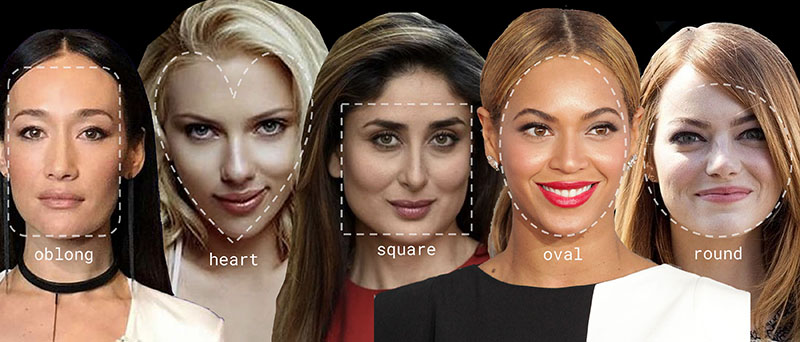
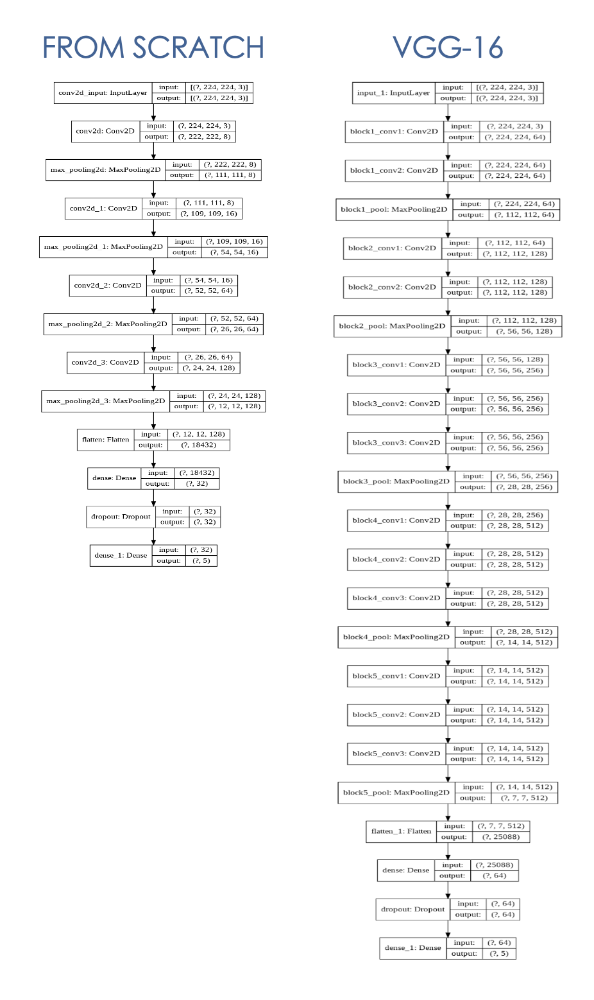
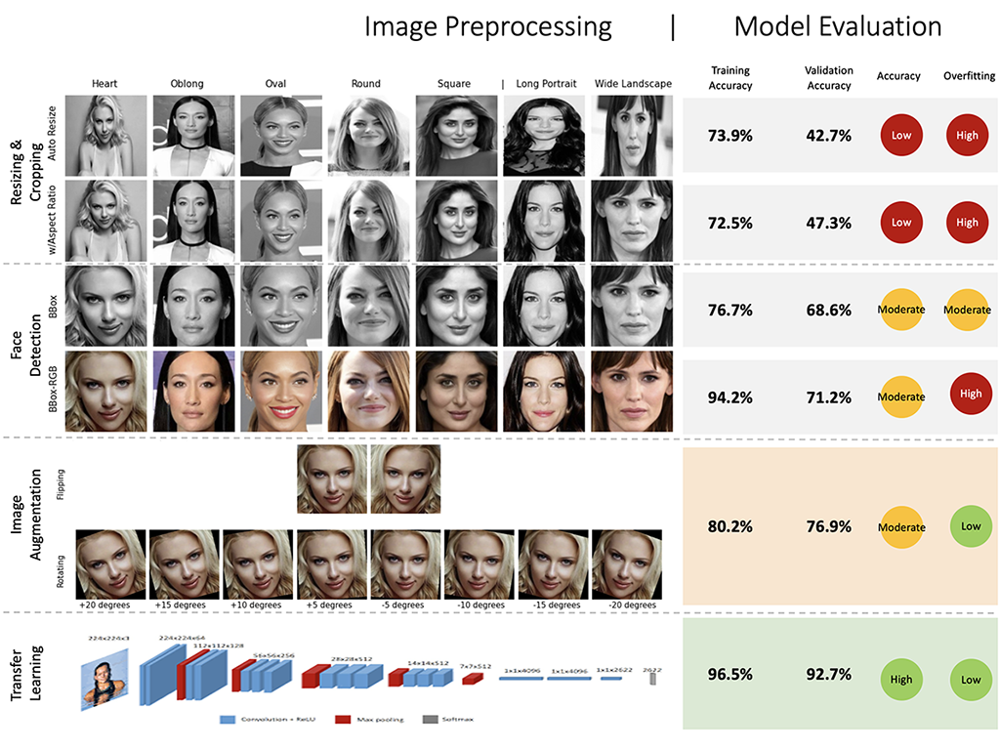
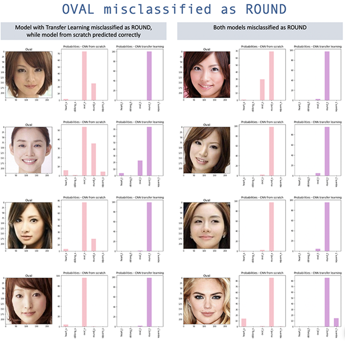
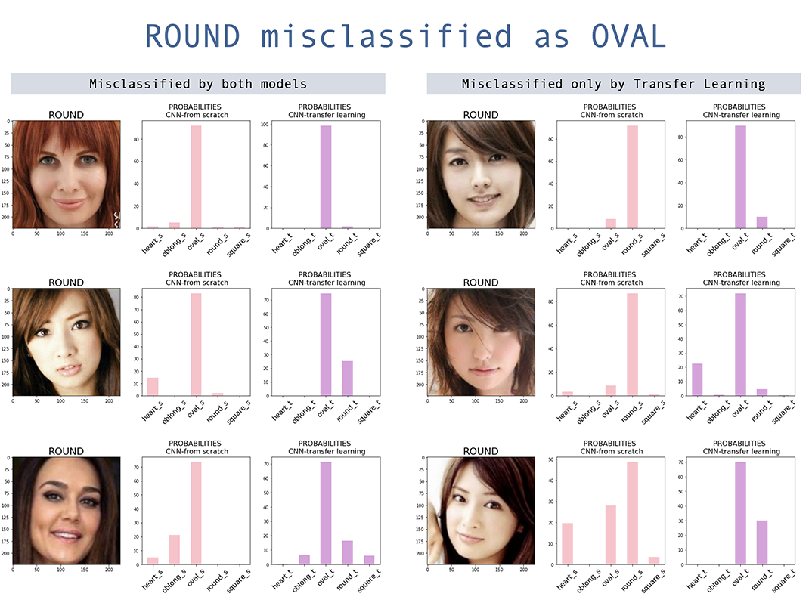

# Face Shape Classification
This is an **image classification project to identify 5 female face shapes using Convolutional Neural Networks (CNN)**.  I completed this as my Capstone Project for Data Science Immersive course with General Assembly (October 2020).

## Problem Statement

Based on [The Deloitte Consumer Review](https://www2.deloitte.com/content/dam/Deloitte/ch/Documents/consumer-business/ch-en-consumer-business-made-to-order-consumer-review.pdf), consumers are demanding more personalised experience, however trial remains low.  In beauty and fashion industry, over 40% of adults aged 16-39 are interested in personalised offer, while trial is only 10%-14%.  Among those who are interested, ~80% are willing to pay at least 10% higher price. 

By being able to classify face shapes will enable brands to offer more personalised solutions to increase customer satisfaction, while increasing margin from premium positioning.  Example of use cases are:
- Personalised content (i.e. make-up tips, hairstyles)
- Personalised recommendations for make-up, glasses/sunglasses, and fashion accessories (i.e. earrings, necklaces, hat, etc)
- Customised beauty products (i.e. facial skincare masks, make-up pallette)

For this project, I will be using Deep Learning approach with Convolutional Neural Networks (CNN) to classify 5 different female face shapes (Heart, Oblong, Oval, Round, Square).  The model that was highest accuracy score will be chosen.

## Executive Summary

I have explored 2 approaches of CNN by **building from scratch** vs. **trasfer learning** with VGG-16 architecture and pre-trained weights from VGGFace.  Transfer learning approach helped increased accuracy, while the most mis-classified face shape is 'Oval'.

Image pre-processing also played an important role in reducing overfitting and increasing validation accuracy.  Key drivers are:
- **Face Detection** using Multi-Task Cascaded Convolutional Neural Network (MTCNN) to automatically detect bounding box around the face.  This helps improve validation accuracy and reduce overfitting.
- **Image Augmentation** by flipping horizontally and rotating +/- 20 degrees. This helps increase accuracy and reduce overfitting.

---

## Project Approach

### Data

The [Face Shape Dataset](https://www.kaggle.com/niten19/face-shape-dataset) is a dataset from Kaggle by Niten Lama. 

This dataset comprises a total of 5000 images of the female celebrities from all around the globe which are categorized according to their face-shape namely: 
- Heart
- Oblong
- Oval 
- Round
- Square

Each category consists of 1000 images (800 for training : 200 for testing)

### Image Pre-processing

Pre-processing of the images is a critical factor in reducing model overfitting to the training dataset, and increasing the validation accuracy.  The following steps have been explored:
- **Face Detection** to automatically locate the face in the image and identify the bounding box around the face for cropping.  I used Multi-Task Cascaded Convolutional Neural Network (MTCNN) as face detector.  Reference: implementation by Iván de Paz Centeno in the [ipazc/mtcnn](https://github.com/ipazc/mtcnn) project.
- **Image Augmentation** to account for different pose (i.e. head tilting), I used horizontal flipping as well as rotating by +/- 20 degrees.  
- **RGB color images** added more dimensions to each image data (3D array for RGB vs 1D array for grayscale).

### Modelling

**CNN Model built from scratch** With limited training data of 4000 images (800 images x 5 classes), I build the model with 4 Convolutional + Max-Pooling Layers, and 2 Dense layers (details below).  

**CNN Model with transfer learning** enables me to use a more complex VGG-16 architecture, by using pre-trained weights from VGGFace that has been trained on over 2.6 Million images.  
- [VGG-16 architecture](https://www.robots.ox.ac.uk/~vgg/research/very_deep/) is designed by [Visual Geometry Group - University of Oxford](https://www.robots.ox.ac.uk/~vgg/), which won awards for image classification and localization from [Imagenet 2014 competition](http://www.image-net.org/challenges/LSVRC/2014/results#clsloc) 
- I used the pre-trained weights from the library of [keras-vggface project](https://github.com/rcmalli/keras-vggface) by Refik Can Malli, which is based on original VGGFace, previously names [Deep Face Recognition](http://www.robots.ox.ac.uk/~vgg/publications/2015/Parkhi15/parkhi15.pdf) by [Visual Geometry Group - University of Oxford](https://www.robots.ox.ac.uk/~vgg/)

### Model Evaluation

Transfer Learning helped improved accuracy significantly, from 76.9% to 92.7%, with the help of pre-trained weights on larger dataset.  

From the models built from scratch, all models performed better than baseline of 20% (5 classes are balanced with 20% each).
- The face detection (bounding box) helped improve accuracy vs. resizing and cropping the image.
- Image Augmentation helped improve accuracy and reduce overfitting.
- RGB color image slightly helped improve accuracy, however with higher overfitting.

Summary of all models below.

#### Misclassification

Both models have highest misclassification on **Oval** face shape.  Although the transfer learning model improved the accuracy of the model built from scratch, yet Oval is still the most misclassified, with the majority incorrectly classifying Oval as Round.  Interestingly, Round face is also misclassified as Oval, although overall misclassification is low.  The confusion between Oval and Round are mostly Asian faces, this is likely because the models has been pretrained on less Asian images. 

### Conclusion & Key Learning:

- **Image pre-processing**, particularly face detection and image augmentation, helped improve accuracy and reduce overfitting.
- With limited datasets (4000 training images), **transfer learning** using pretrained weights on larger datasets (VGGFace 2.6 million images) and more complex architecture (VGG16), significantly helped improve accuracy, reduce overfitting, and faster trainging time.The CNN model from scratch achieves accuracy of ~80%, while incorporating transfer learning using VGG-Face increased the accuracy to over 90%. 
- Majority of the **misclassification** is Oval face shape, especially Asian oval faces are classified as round, likely because the model has been pretrained on fewer Asian images.
- When testing on unseen data, **face detection** is the critical step to drive accuracy of predictions.  The model performs better on images where the bounding box can be easily detected, however does not predict well on images that the full face cannot be detected (i.e. tilted face, wearing sunglasses, cropped parts of the face).  

