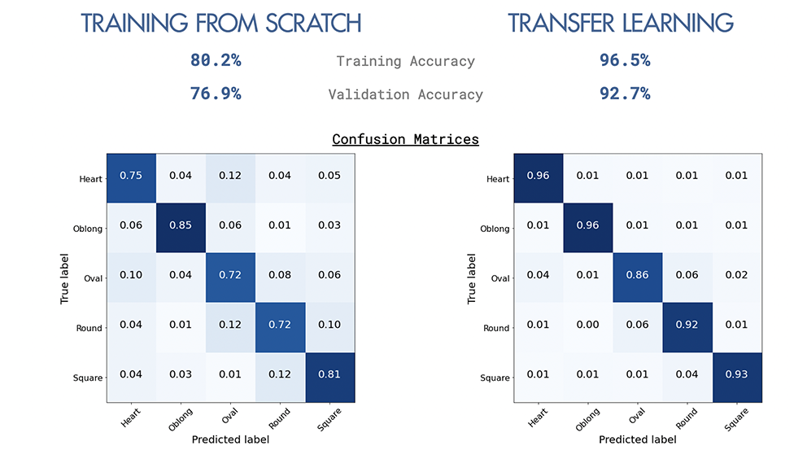

# Face Shape Classification
This is an **image classification project to identify 5 female face shapes using Convolutional Neural Networks (CNN)**.  I completed this as my Capstone Project for Data Science Immersive course with General Assembly (October 2020).

## Problem Statement

Based on [The Deloitte Consumer Review](https://www2.deloitte.com/content/dam/Deloitte/ch/Documents/consumer-business/ch-en-consumer-business-made-to-order-consumer-review.pdf), consumers are demanding more personalised experience, however trial remains low.  In beauty and fashion industry, over 40% of adults aged 16-39 are interested in personalised offer, while trial is only 10% and 14% respectively.  Among those who are interested, around 80% are willing to pay premium price (10% or more). 

By being able to classify face shapes will enable brands to offer more personalised solutions to better satisfy their consumers, while increasing margin from premium positioning.  Example of use cases are:
- Personalised content (i.e. make-up tips, hairstyles)
- Personalised recommendations for make-up, glasses/sunglasses, and fashion accessories (i.e. earrings, necklaces, hat, etc)
- Customised beauty products (i.e. facial skincare masks, make-up pallette)

For this project, I will be using Deep Learning approach with Convolutional Neural Networks (CNN) to classify 5 different female face shapes (Heart, Oblong, Oval, Round, Square).  The model that was highest accuracy score will be chosen.

## Executive Summary

In this project I have explored 2 approaches for CNN by **building from scratch** vs. **trasfer learning** with VGG-16 architecture and pre-trained weights from VGGFace as implemented in [keras-vggface project](https://github.com/rcmalli/keras-vggface) by Refik Can Malli.  Transfer learning approach helped increased accuracy.  The most mis-classified face shape is 'Oval'.

**Pre-processing of the images** is a critical factor to drive higher accuracy.  In the project, I have explored the following:
- **Face Detection** to identify the bounding box around the face significantly drove validation accuracy (from 47.3% to 68.6%).  For this project, I used Multi-Task Cascaded Convolutional Neural Network (MTCNN) as face detector.  Reference: implementation by Iván de Paz Centeno in the [ipazc/mtcnn](https://github.com/ipazc/mtcnn) project.
- **Image Augmentation** to account for different pose (i.e. head tilting).  For this project I used flipping and +/- 20 degrees rotation, which improved accuracy by 5.7%.  
- **RGB color images** improved accuracy by 2-3% vs. grayscale.

# Data

The [Face Shape Dataset](https://www.kaggle.com/niten19/face-shape-dataset) is a dataset from Kaggle by Niten Lama. 

This dataset comprises a total of 5000 images of the female celebrities from all around the globe which are categorized according to their face-shape namely: 
- Heart
- Oblong
- Oval 
- Round
- Square

Each category consists of 1000 images (800 for training : 200 for testing)

### Image Pre-processing
Face detection is the process of automatically locating faces in a photograph and localizing them by drawing a bounding box around their extent.

In this tutorial, we will also use the Multi-Task Cascaded Convolutional Neural Network, or MTCNN, for face detection, e.g. finding and extracting faces from photos. This is a state-of-the-art deep learning model for face detection, described in the 2016 paper titled “Joint Face Detection and Alignment Using Multitask Cascaded Convolutional Networks.”

We will use the implementation provided by Iván de Paz Centeno in the ipazc/mtcnn project. This can also be installed via pip as follows:

## Conclusion & Key Learning:

The CNN models are suitable for image classification as it trains well with fewer parameter when compared to Fully Connected model.  The CNN model from scratch achieves accuracy of ~80%, while incorporating transfer learning using VGG-Face increased the accuracy to over 90%. 

Key learning:
- Image pre-process (specifically the bounding box) helps the model train better especially with limited dataset (4000 training images).
- Transfer Learning with the weights trained on larger datasets (2.6 million images) can help improve the accuracy of training as well as the speed.  
- Oval shape is harder to predict with misclassification in different classes.  
- The model performs better on images where the bounding box can be easily detected, however does not predict well on images that the full face cannot be detected (i.e. circle frame, or tilted angle).  

